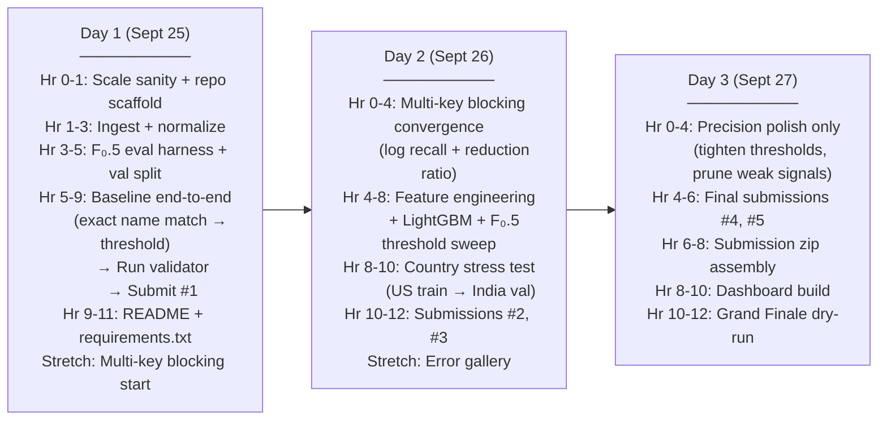

# 🏗️ Resolvent — Full Implementation Plan
## Amazon ML Challenge 2026: Business Entity Resolution

> **Window:** Sept 25–27, 2026 (72 hrs) · Metric: **F₀.5 macro-avg** · Submissions: max 5/day

---

## Part 1 — Data & Schema Reality Check (Confirmed)

### Confirmed Schema (all 3 sources, identical 4-column layout)
| Column | Type | Notes |
|---|---|---|
| `entity_id` | string | `S1-`/`S2-`/`S3-` + 9-digit number (e.g. `S1-925783039`) |
| `business_name` | string | Contains Hindi/Devanagari script, typos, DBA names, abbreviations |
| `business_address` | string | Missing components, landmark refs, transliterations, `NaN` |
| `country` | string | `US`, `India` in train; **`France` added in test** (open-set) |

### Ground Truth Format
| Column | Notes |
|---|---|
| `source1_entity_id` | S1 entity |
| `matched_entity_ids` | Comma-separated S2-/S3- IDs (empty = singleton) |

### Confirmed Scale
| File | Rows |
|---|---|
| `train_source1.tsv` | **2,206,821** |
| `train_source2.tsv` | **5,034,616** |
| `train_source3.tsv` | **5,285,603** |
| `train_ground_truth.tsv` | **2,206,821** |
| `test_source1.tsv` | ~1.7M (from validator docstring) |
| `test_source2.tsv` + `test_source3.tsv` | ~1.7M combined |

### Key EDA Findings
- **Singleton rate:** ~5.6% of S1 entities have no match → correctly predicting these earns free F₀.5 = 1.0 per entity
- **Match cardinality:** Most S1 entities match **2–5** S2/S3 records (distribution peaks at 3–4)
- **Languages in names:** Hindi script (Devanagari) present in S2/S3 — pure ASCII string similarity won't be robust
- **Address noise observed:** `NaN` addresses (S3), landmark-based refs, reversed component order, missing PIN codes
- **Name noise observed:** URLs as business names (`wilfordhancock.com`), typos (`Tetlecommunication`), DBA trade names, script mixing

> [!IMPORTANT]
> All schemas are **perfectly aligned** across S1, S2, S3 — same 4 columns, same `entity_id` prefix convention, same TSV format. No schema mismatches. Implementation can proceed immediately.

---

## Part 2 — Competitive Novelty Assessment

### What the crowd will do
Most teams at this competition level will:
1. Simple TF-IDF cosine on `business_name`, threshold at 0.5
2. Maybe add Jaccard on name tokens
3. Country-filtered blocking (breaking France generalization)
4. Single threshold tuned on accuracy, not F₀.5

### What makes this pipeline stand out globally

| Innovation | Why it's rare/hard | Competitive edge |
|---|---|---|
| **Multi-key inverted-index blocking** at 2.2M+ scale | Most teams will hit O(n²) wall and time out | Enables higher recall ceiling than competitors who are forced to simplify |
| **Phonetic blocking (Soundex/Metaphone) + n-gram backstop** | Catches transliterations, typos, script variants that token overlap misses | Uniquely needed for India data (name → Hindi → Latin transliteration) |
| **F₀.5-calibrated threshold sweep** (not accuracy) | Extremely few teams will do this correctly | Directly optimizes the scored metric — teams optimizing accuracy/F1 will be ~5–8 pts below on F₀.5 |
| **Hard-negative sampling per S1 bucket** | Standard practice in professional ER but rarely done in hackathons | Classifier learns the actual decision boundary, not trivial positives vs. random noise |
| **Held-out country stress test** (train US → validate India only) | Simulates France before test data reveals it | Catches over-fitting to US/India patterns before submission |
| **Singleton precision protection** | Singletons earn 1.0 each; false merge earns 0.0 — most teams ignore this | Precision discipline from day 1 protects a guaranteed credit pool |
| **Char n-gram TF-IDF** (not word-level) for transliteration robustness | Script-agnostic, handles Devanagari transliteration variants automatically | Works on France data without any French-specific logic |
| **ID-existence self-check** in submit module | Validator's `--check-ids` is OFF by default — most teams won't notice | Prevents silent score penalties from phantom IDs |

> [!NOTE]
> The combination of **F₀.5-calibrated threshold + hard-negative training + singleton precision protection** is the core triad that separates professional-grade ER from hackathon ER. Most worldwide competitors will miss at least two of these three.

---

## Part 3 — Repository Layout (To Create)

```
code/business_entity_resolution/
├── src/
│   ├── ingest/
│   │   ├── __init__.py
│   │   └── load_normalize.py          # load_source(), normalize_name(), normalize_address()
│   ├── blocking/
│   │   ├── __init__.py
│   │   └── candidate_gen.py           # InvertedIndexBlocker, multi-key union, recall logging
│   ├── features/
│   │   ├── __init__.py
│   │   └── similarity.py              # NameFeatures, AddressFeatures, StructuralFeatures
│   ├── matching/
│   │   ├── __init__.py
│   │   ├── train.py                   # hard-neg sampling, LightGBM trainer
│   │   └── predict.py                 # batch inference, threshold sweep
│   ├── evaluate/
│   │   ├── __init__.py
│   │   └── score_f05.py               # vectorized F₀.5 macro scorer, error gallery
│   └── submit/
│       ├── __init__.py
│       └── package.py                 # write TSVs, ID-existence check, run validator
├── README.md
└── requirements.txt
output/
├── matching_results.tsv
└── candidate_pairs.tsv
data/
└── val_split/                         # held-out validation split (generated once)
```

---

## Part 4 — Detailed Implementation Plan

### Phase 0 — Infrastructure (Day 1, Hrs 0–1)

**Goal:** Confirm scale, set up repo structure, install dependencies.

#### 0.1 Dependencies (`requirements.txt`)
```
pandas==2.2.2
numpy==1.26.4
lightgbm==4.3.0
scikit-learn==1.4.2
jellyfish==1.0.3          # Jaro-Winkler, Soundex, Metaphone
rapidfuzz==3.9.3           # fast Levenshtein, token_set_ratio
python-Levenshtein==0.25.1
```

**No sentence-transformers yet** — add only if pure string features plateau (Day 2 stretch).

#### 0.2 Repo scaffold
- Create all `src/` subdirs with `__init__.py`
- Create `output/` and `data/val_split/` dirs

---

### Phase 1 — Ingestion & Normalization (Day 1, Hrs 1–3)
**File:** `src/ingest/load_normalize.py`

#### Schema (confirmed identical for all sources)
```
entity_id | business_name | business_address | country
```

#### Normalization rules
| Field | Transform |
|---|---|
| `business_name` | lowercase → strip punctuation (keep `&`) → `&`/`and` unify → legal suffix canonicalization table → collapse whitespace |
| `business_address` | lowercase → address abbreviation table → collapse whitespace → keep as open string (no structured parsing) |
| `country` | raw string, **never** normalize/filter/one-hot |

#### Legal suffix table (minimum viable)
```python
LEGAL_SUFFIX_MAP = {
    "corporation": "corp", "incorporated": "inc", "limited": "ltd",
    "private": "pvt", "llp": "llp", "llc": "llc",
    "pvt ltd": "pvt ltd",  # keep combined form
}
```

#### Address abbreviation table
```python
ADDR_ABBREV = {
    "road": "rd", "street": "st", "avenue": "ave",
    "boulevard": "blvd", "drive": "dr", "lane": "ln",
    "court": "ct", "place": "pl", "highway": "hwy",
}
```

#### Key design decisions
- Normalization is **for matching features only** — raw fields stored separately for the output
- `NaN` addresses → empty string (don't crash, don't impute)
- Devanagari names: **do NOT transliterate** — keep as-is; char n-gram features are script-agnostic

#### `__main__` entrypoint
Load both train sources, normalize, write normalized parquet/TSV to `data/`, print row counts.

---

### Phase 2 — Blocking / Candidate Generation (Day 1–2, Hrs 3–7)
**File:** `src/blocking/candidate_gen.py`

> [!CAUTION]
> **This is the most critical phase.** Blocking recall upper-bounds leaderboard F₀.5. A miss here cannot be recovered downstream. No O(n²) loops — only inverted index lookups.

#### Architecture: `InvertedIndexBlocker`
```
index: Dict[blocking_key → List[entity_id]]
```

**Multi-key blocking passes (union all, deduplicate):**

| Pass | Key construction | Catches |
|---|---|---|
| **Name token** | sorted frozenset of significant tokens after stopword/suffix strip; candidates share ≥1 token | Standard name overlap |
| **Phonetic (Soundex)** | Soundex code of primary name token | Typos, transliteration variants |
| **Phonetic (Metaphone)** | Metaphone of primary name token | Double-metaphone catches more |
| **Address token** | Sorted frozenset of street-name tokens after abbreviation normalization | Same address, different name variants |
| **Trigram n-gram (backstop)** | Top-3 trigrams from `name + " " + address`, each trigram as a key | Catches reordering, partial matches the above miss |

#### Partitioning
- Partition blocking by `country` string — candidates are only generated within same country. **France entities stay in their own bucket automatically** since `country` is open-set string, no hardcoding needed.

#### Logging (mandatory on every change)
```
Blocking recall ceiling: XX.X%  (true matches in candidate set / total true matches)
Reduction ratio: XX.XX  (candidates / full cross-product)
Candidate pairs: X,XXX,XXX
```

#### `candidate_pairs.tsv` generation
Written from the **exact same candidate set** that goes into the matcher — not an early pass.

#### Performance target
- Full S1 (2.2M) × S2+S3 (10M+): must complete in **< 30 minutes** on commodity hardware
- Implementation: vectorized pandas `groupby` + Python `dict` inverted index; no nested `for` loops over rows

---

### Phase 3 — Held-Out Validation Split (Day 1, Hrs 3–5, parallel with blocking)
**File:** `src/evaluate/score_f05.py` + split generation script

#### Split strategy
- Stratified by `country` so both US and India are in val
- Hold out **~10% of S1 entities** → `data/val_split/val_s1.tsv`, `val_s2.tsv`, `val_s3.tsv`, `val_ground_truth.tsv`
- **Stress-test split:** additional split where *all* India entities held out → simulates France OOD

#### F₀.5 scorer (vectorized)
```python
def score_f05_macro(pred: dict[str, set], truth: dict[str, set]) -> float:
    # Per S1 entity: compute precision, recall, F₀.5
    # Singletons: truth[s1] = {} and pred[s1] = {} → score 1.0
    #             truth[s1] = {} and pred[s1] != {} → score 0.0
    # Vectorized via pandas groupby-aggregate, NOT a Python for-loop
```

#### Output
- Per-entity F₀.5 array → macro average
- Precision / recall breakdown
- Error gallery: worst false merges (high-confidence wrong matches), worst misses (high-confidence false negatives)

---

### Phase 4 — Feature Engineering (Day 2, Hrs 0–4)
**File:** `src/features/similarity.py`

#### Name features (per S1–candidate pair)
| Feature | Implementation | Rationale |
|---|---|---|
| `name_jaro_winkler` | `jellyfish.jaro_winkler_similarity` | Prefix-weighted, good for abbreviations |
| `name_levenshtein_norm` | `rapidfuzz.distance.Levenshtein.normalized_similarity` | Edit distance normalized |
| `name_token_jaccard` | Jaccard on token sets | Order-invariant, handles reordering |
| `name_tfidf_cosine` | **Char trigram TF-IDF** (script-agnostic) | Handles Devanagari, France names equally |
| `name_exact_norm` | 1.0 if normalized names identical | Cheap high-precision signal |
| `name_phonetic_match` | Soundex/Metaphone equality | Transliteration/typo robustness |
| `name_len_ratio` | `min/max` of char lengths | Structural filter |

#### Address features
| Feature | Implementation | Rationale |
|---|---|---|
| `addr_token_jaccard` | Jaccard on address token sets | Order-invariant |
| `addr_levenshtein_norm` | Normalized edit distance | Catches abbreviation variants |
| `addr_tfidf_cosine` | Char trigram TF-IDF on address | Script-agnostic |
| `addr_empty_both` | 1 if both addresses NaN/empty | Don't penalize shared missingness |
| `addr_empty_one` | 1 if only one is NaN | Structural flag |

#### Structural features
| Feature | Implementation |
|---|---|
| `country_match` | 1 if same country string (never used to filter, only as feature) |
| `name_token_count_diff` | abs difference in token counts |

> [!TIP]
> **Do NOT add features that hard-code US/India patterns.** E.g. don't add "has_US_state_abbrev" as a feature — it'll help on US but hurt France. All features above are language/country agnostic.

---

### Phase 5 — Matching Model (Day 2, Hrs 4–8)
**File:** `src/matching/train.py` + `predict.py`

#### Training pair construction (hard-negative sampling)
```
For each S1 entity e:
  positives = true matches from ground truth
  negatives = sample K negatives from e's blocking candidates (not true matches)
             (hard negatives — things blocking thought were plausible)
  K = min(5 × |positives|, 50)  # class balance control
```

**Why not random negatives?** Random pairs have near-zero similarity — trivial to classify. Hard negatives force the model to learn the actual decision boundary (similar-but-different businesses).

#### Model: LightGBM gradient-boosted classifier
```python
lgb.LGBMClassifier(
    n_estimators=500,
    learning_rate=0.05,
    num_leaves=63,
    class_weight='balanced',   # handles imbalance
    objective='binary',
    metric='binary_logloss',
)
```

**Why LightGBM over XGBoost/neural net?**
- Faster than XGBoost on tabular features at this scale
- Produces calibrated probabilities (needed for threshold sweep)
- Highly interpretable feature importances (methodology doc material)
- Trivially satisfies ≤8B params and MIT license

#### Threshold calibration
```python
# Sweep threshold on VALIDATION SET only, optimize F₀.5 directly
thresholds = np.arange(0.1, 0.95, 0.01)
best_thresh = max(thresholds, key=lambda t: score_f05_macro(
    predict(val_candidates, threshold=t), val_truth
))
```

> [!IMPORTANT]
> **Never tune threshold on training set.** Always on the held-out validation split. This is where most teams lose points — they tune on accuracy instead of F₀.5 or tune on the wrong split.

#### Inference
- Batch-process candidates in chunks of 100k pairs to stay memory-efficient
- Apply threshold: pairs above → match; below → no match
- Collect per-S1-entity match sets

---

### Phase 6 — Clustering & Output (Day 2–3)
**File:** `src/submit/package.py`

#### One-to-many handling
- Each S1 entity can match **multiple** S2/S3 records independently
- No graph clustering needed — it's a bipartite S1→{S2,S3} problem, not a full-graph deduplication
- Singleton protection: if no candidates pass the threshold → output empty `matched_entity_ids`

#### ID-existence self-check
```python
# Load valid S2/S3 IDs from test source files
valid_s23_ids = set(test_source2.entity_id) | set(test_source3.entity_id)
# Assert all matched IDs exist
bad_ids = matched_ids - valid_s23_ids
assert not bad_ids, f"Phantom IDs in output: {bad_ids}"
```

#### Superset assertion
```python
# Every matched ID must appear in candidate_pairs.tsv
for s1_id, matched in matching_results.items():
    assert matched.issubset(candidates[s1_id]), f"Match not in candidates for {s1_id}"
```

#### Write output
```python
# matching_results.tsv
df_match.to_csv("output/matching_results.tsv", sep="\t", index=False, encoding="utf-8")
# candidate_pairs.tsv
df_cand.to_csv("output/candidate_pairs.tsv", sep="\t", index=False, encoding="utf-8")
```

#### Validator gate
```bash
python utils/validate_submission.py \
  --matching output/matching_results.tsv \
  --candidate output/candidate_pairs.tsv \
  --test-dir dataset/test
# Must print PASS before any leaderboard upload
```

---

### Phase 7 — Country Generalization Stress Test (Day 2, Hrs 8–10)
**File:** Validation script in `src/evaluate/`

#### Protocol
1. Train model on **US-only** train split
2. Evaluate on **India-only** validation split
3. Measure F₀.5 drop — if large, features/blocking have US-specific assumptions
4. Fix any failed assumptions, confirm recovery on India
5. This is our best proxy for France before test scoring

#### What to look for
- Phonetic blocking: does Soundex work on transliterated Indian names? (it should — they're romanized)
- Char n-gram TF-IDF: script-agnostic by design — should hold
- Address features: India addresses have no state abbreviations, no ZIP codes — `addr_token_jaccard` should still work

---

### Phase 8 — Pipeline Orchestration (Day 1, end)
**Single entry point script:** `code/business_entity_resolution/run_pipeline.py`
```bash
python run_pipeline.py \
  --train-dir dataset/train \
  --test-dir dataset/test \
  --output-dir output \
  --val-fraction 0.1
```

Steps in order:
1. Load + normalize all 6 TSVs (train + test, all 3 sources)
2. Build validation split (stratified by country)
3. Run multi-key blocking → generate `candidate_pairs.tsv` (test)
4. Compute features for all train candidate pairs
5. Hard-negative sampling + LightGBM training
6. Threshold sweep on validation split → select best threshold
7. Batch inference on test candidates
8. ID-existence check + superset assertion
9. Write both output TSVs
10. Run validator

---

### Phase 9 — Dashboard (Day 3, Hrs 8–10)
**File:** `dashboard/index.html` (standalone HTML, no server)

Three views per `frontend.md`:
1. **Scorecard** — F₀.5 macro, precision/recall, singleton accuracy, per-country breakdown
2. **Blocking funnel** — cross-product → candidates → final matches, recall ceiling annotated
3. **Entity explorer** — pick S1 record, see candidates with similarity scores + final decision; worst false merges gallery

Tech stack: Vanilla JS + Chart.js (CDN), data loaded from JSON files generated by the pipeline. No framework, no build step — opens in any browser at the Grand Finale.

---

## Part 5 — Day-by-Day Execution Schedule



---

## Part 6 — Risk Register & Mitigations

| Risk | Probability | Impact | Mitigation |
|---|---|---|---|
| Blocking is O(n²) and times out | Medium | Fatal | Inverted index from day one; scale check before anything else (Day 1 Hr 0) |
| France generalization fails | High | High | Char n-gram features (script-agnostic); country-partitioned blocking; stress test on Day 2 |
| Threshold tuned for wrong metric | High | High | Always sweep for F₀.5, not accuracy/F1 |
| Validator PASS but phantom IDs | Medium | Silent | Build own ID-existence assertion in `src/submit/` |
| Matched ID not in candidates TSV | Medium | Audit fail | Superset assertion gates every output write |
| Hard-negative sampling too aggressive | Low | Medium | Monitor class ratio; cap negatives at 5× positives |
| LightGBM training too slow at scale | Low | High | Train on 20% sample if needed; full training only after confirmed correct |
| Leaderboard submission burned on broken output | Low | High | Validator gate is mandatory; never upload without PASS |

---

## Part 7 — F₀.5 Optimization Strategy

$$F_{0.5} = \frac{(1 + 0.5^2) \cdot P \cdot R}{0.5^2 \cdot P + R} = \frac{1.25 \cdot P \cdot R}{0.25 \cdot P + R}$$

**Precision counts 4× more than recall** in terms of marginal impact on F₀.5. The optimal strategy:

1. **Maximize recall at blocking** — any true match not in `candidate_pairs.tsv` is permanently lost
2. **Maximize precision at matching** — every false merge costs more than a missed match
3. **Protect singletons aggressively** — 5.6% of S1 entities are singletons; getting them right earns free 1.0 per entity

**Calibration target:** F₀.5 ≥ 0.80 on validation split before any leaderboard submission.

---

## Part 8 — Submission Package Checklist

```
☐ output/matching_results.tsv         — validator PASS, every S1 entity present
☐ output/candidate_pairs.tsv          — superset of matching_results, same S1 coverage
☐ code/business_entity_resolution/
  ☐ src/ingest/load_normalize.py      — standalone __main__ entrypoint
  ☐ src/blocking/candidate_gen.py     — logs recall + reduction ratio
  ☐ src/features/similarity.py        — standalone __main__ entrypoint
  ☐ src/matching/train.py             — standalone __main__ entrypoint
  ☐ src/matching/predict.py           — standalone __main__ entrypoint
  ☐ src/evaluate/score_f05.py         — standalone __main__ entrypoint
  ☐ src/submit/package.py             — ID-existence check + superset assertion
  ☐ README.md                         — exact reproduce instructions, data → outputs
  ☐ requirements.txt                  — pinned versions
☐ Documentation_template.md (filled)
  ☐ §1 Executive Summary
  ☐ §2.1 EDA / noise findings
  ☐ §2.2 Core innovation named + described
  ☐ §3 Blocking strategy + recall ceiling reported
  ☐ §4 Features + model + threshold method
  ☐ §5 Validation F₀.5 + error gallery
  ☐ §6 Conclusion
  ☐ Appendix A: code structure + entry points
  ☐ Appendix B: charts / dashboard screenshots
```

---

## Implementation Order (Start Here)

```
1. mkdir code/business_entity_resolution/src/{ingest,blocking,features,matching,evaluate,submit}
2. touch each __init__.py
3. pip install -r requirements.txt
4. Implement src/ingest/load_normalize.py  → confirm schema loads correctly
5. Implement src/evaluate/score_f05.py + val split  → have your feedback loop before modeling
6. Implement naive baseline (exact name match blocking + single threshold)  → first submission
7. Implement src/blocking/candidate_gen.py (multi-key)  → Day 2 target
8. Implement src/features/similarity.py  → Day 2
9. Implement src/matching/train.py + predict.py  → Day 2
10. Implement src/submit/package.py  → before every submission
```
